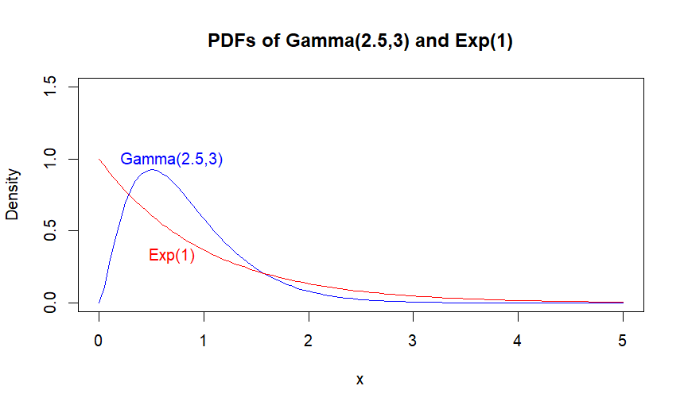
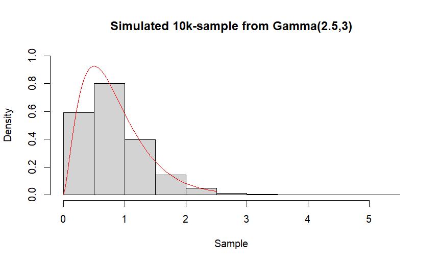
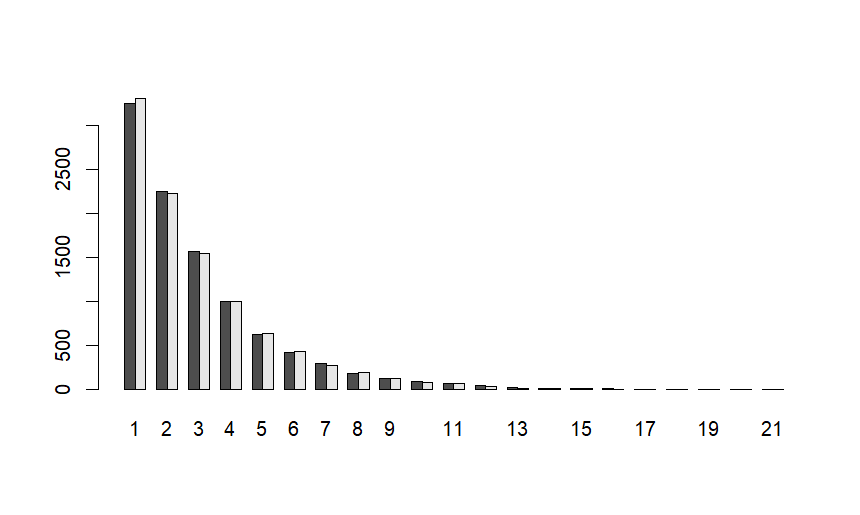
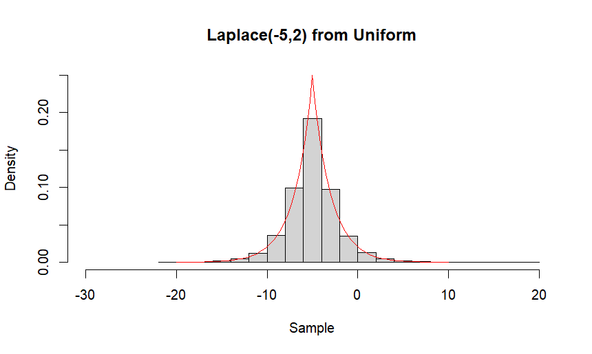
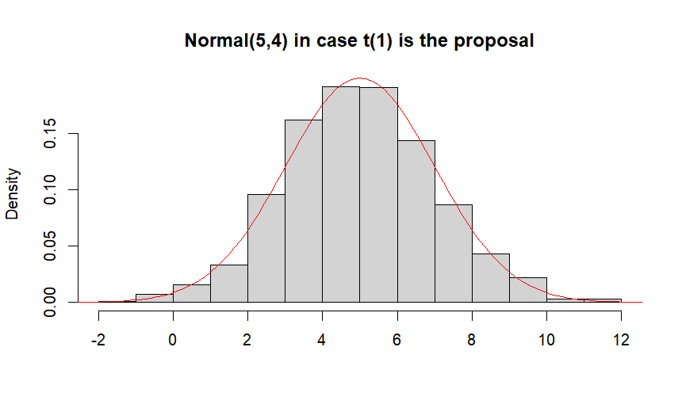
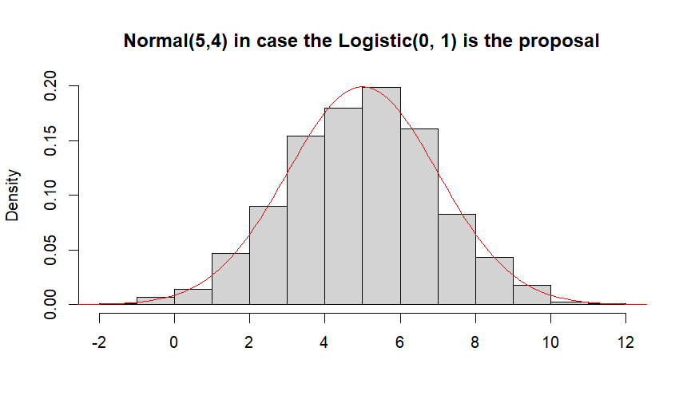
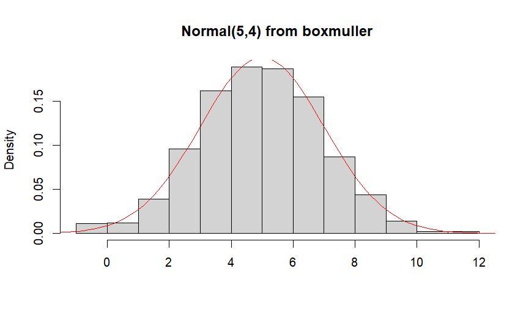
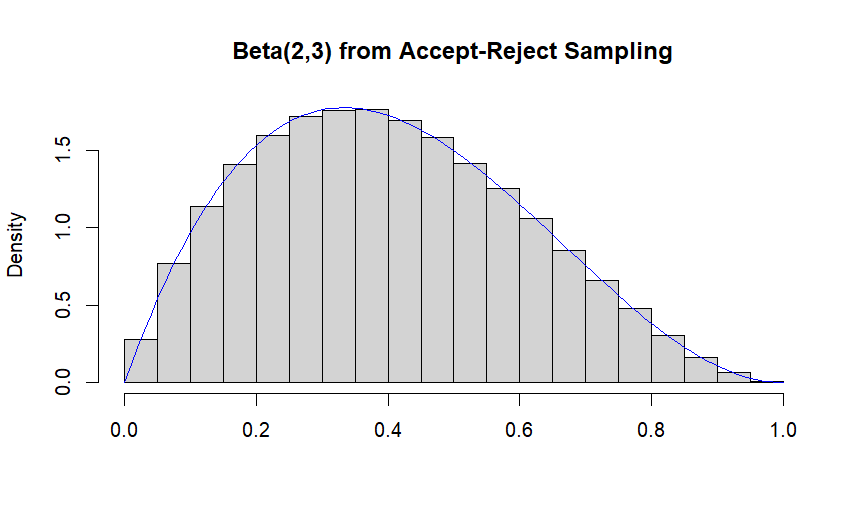

# Monte Carlo Simulation of Random Variables (R)

This repository contains an academic project completed as part of the course **Computational Statistics**.

## 📖 Overview
The project contains five main tasks that focus on the implementation and analysis of Monte Carlo simulation techniques for generating random variables from non-trivial probability distributions.

It includes custom implementations of:

- Accept-Reject Sampling
- Generalized Inverse Simulation
- Box-Muller Algorithm

The emphasis is placed on understanding the underlying statistical methodology rather than relying exclusively on built-in R functions.

## 📃 Contents

### 1. Gamma Distribution via Accept-Reject Sampling

Implementation of the accept-reject algorithm for simulating observations from the $\text{Gamma}(2.5, 3)$ distribution using the $\text{Exp}(1)$ distribution as the proposal.



Main components:

- Construction of an unnormalized Gamma density
- Calculation of the acceptance probability
- Simulation of 10,000 observations
- Empirical acceptance probability estimation
- Histogram and theoretical density comparison


### 2. Geometric Distribution via Generalized Inverse Simulation 

Simulation from the $\text{Geometric}\left\(\tfrac{1}{3}\right\) + 1$ distribution using the generalized inverse CDF method.

Main components:

- Derivation and implementation of the generalized inverse CDF
- Simulation of 10,000 observations
- Comparison against R's built-in `rgeom()` function.


### 3. Laplace Distribution via Inverse Transform Sampling

Custom simulation of the $\text{Laplace}(-5, 2)$ distribution using the inverse CDF method.

Main components:

- Piecewise derivation of the inverse CDF 
- Custom density construction
- Histogram and theoritical density visualization


### 4. Normal Distribution via Accept-Reject-Sampling 

Simulation from the $\mathcal{N}(5, 4)$ distribution using two different proposal distributions:


- Student's $\mathcal{t}(1)$



- $\text{Logistic}(0,1)$



The exercise also includes:

- Comparison of proposal efficiency
- Custom implementation of the Box-Muller algorithm

- Runtime benchmarking using the `microbenchmark` package

### 5. Beta Distribution via Accept-Reject-Sampling

Simulation from the $\text{Beta}$ distribution using the accept-reject algorithm with the $\mathcal{U}(0,1)$ distribution as the proposal.

Main components:

- Construction of method-of-moments estimators for the Beta distribution parameters
- Generation of 10,000 random samples of size 20 from the $\text{Beta}(2,3)$ distribution
- Empirical estimation of:
  - bias
  - variance
  - root mean square error (RMSE)
- Visualization of the simulated Beta distribution against the theoretical density


## ⚙️ Tools and Technologies Used
- R
- RStudio
- microbenchmark

## ▶️ Running the Code

Open the `MonteCarloSimulation.Rproj` file in RStudio and run the individual scripts separately.

Before running the `Normal_AcceptReject.R` script make sure you install the `microbenchmark` package first:
```r
install.packages("microbenchmark")
```

## 👨‍💻 Author
**Marios Giannakopoulos**

Department of Mathematics

National and Kapodistrian University of Athens


